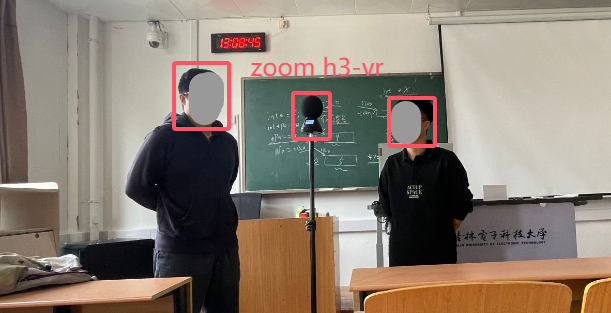
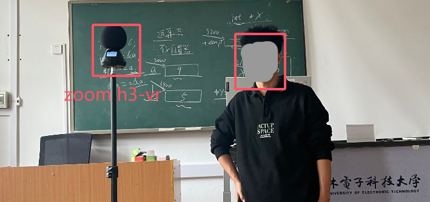
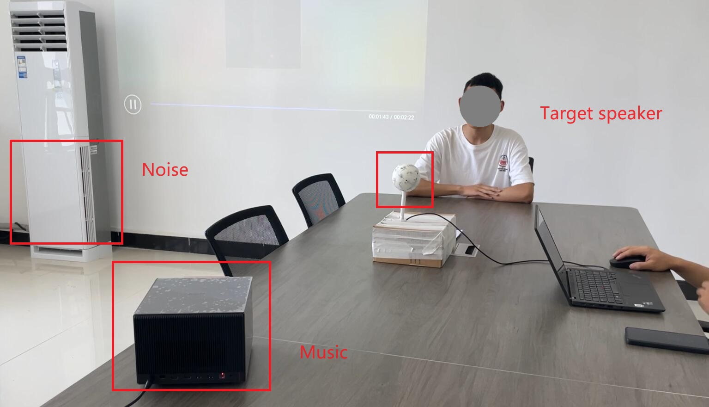
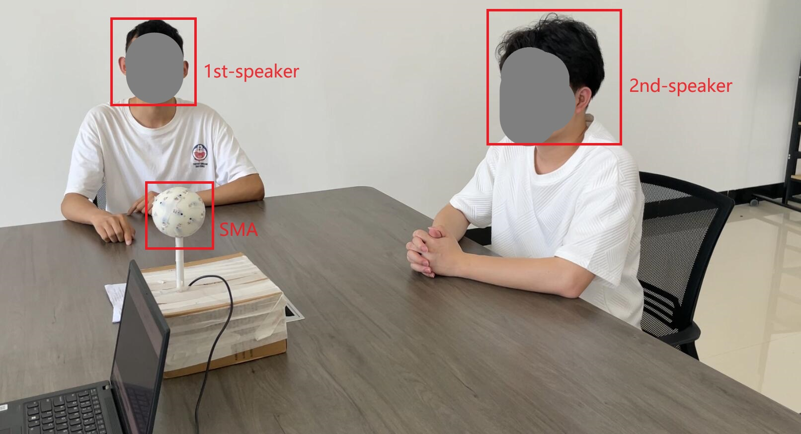
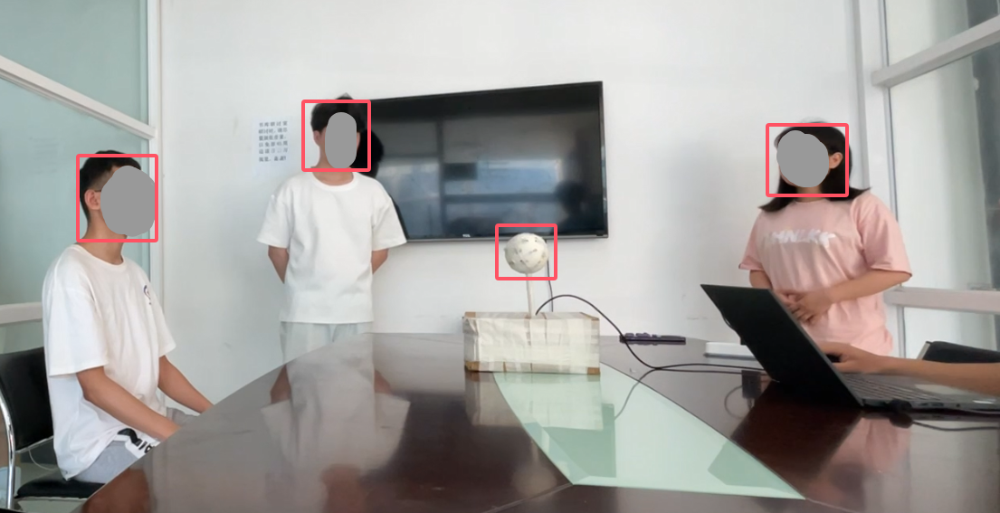

## Speech Enhancement for Ambisonics Input-output Systems: A Unified Neural Filtering Framework and Reverberation Shaping

Shiqi Wang, Hongbing Qiu, Xiyu Song, Mei Wang, Fangzhi Yao

> Key Laboratory of Cognitive Radio and Information Processing, Ministry of Education, 
> Guilin University of Electronic Technology, 
> Guilin, China

------

| Filter Matrix | Target  | Description                                   |
| ------------- | ------- | --------------------------------------------- |
| Mask in SHD   | Revb    | Unprocessed reverberant speech                |
| Mask in SHD   | RTS     | Multi-channel RTS extension, temporal shaping |
| BP in SHD     | RTS-MD  | Jointed temporal and spatial shaping          |
| BP in SHD     | RTS-OMD | Jointed temporal and spatial shaping          |

[TOC]

**Please listen with headphones, all Ambisonics audio is decoded into binaural fomat.**

### Simulated Scenarios (FOA)

##### Sample No.1

| Observation                                                  |                                                              |
| ------------------------------------------------------------ | ------------------------------------------------------------ |
| <audio src="wav/simu_07.wav" controls="controls">Your browser does not support the audio element.</audio> |                                                              |
| Revb (reference)                                             | Revb (estimation)                                            |
| <audio src="wav/simu_07_revb_ref.wav" controls="controls">Your browser does not support the audio element.</audio> | <audio src="wav/simu_07_revb.wav" controls="controls">Your browser does not support the audio element.</audio> |
| RTS (reference)                                              | RTS (estimation)                                             |
| <audio src="wav/simu_07_rts_ref.wav" controls="controls">Your browser does not support the audio element.</audio> | <audio src="wav/simu_07_rts.wav" controls="controls">Your browser does not support the audio element.</audio> |
| RTS-MD (reference)                                           | RTS-MD (estimation)                                          |
| <audio src="wav/simu_07_rtsdi_ref.wav" controls="controls">Your browser does not support the audio element.</audio> | <audio src="wav/simu_07_rtsdi.wav" controls="controls">Your browser does not support the audio element.</audio> |
| RTS-OMD (reference)                                          | RTS-OMD (estimation)                                         |
| <audio src="wav/simu_07_rtswdi_ref.wav" controls="controls">Your browser does not support the audio element.</audio> | <audio src="wav/simu_07_rtswdi.wav" controls="controls">Your browser does not support the audio element.</audio> |

##### Sample No.2

| Observation                                                  |                                                              |
| ------------------------------------------------------------ | ------------------------------------------------------------ |
| <audio src="wav/simu_08.wav" controls="controls">Your browser does not support the audio element.</audio> |                                                              |
| Revb (reference)                                             | Revb (estimation)                                            |
| <audio src="wav/simu_08_revb_ref.wav" controls="controls">Your browser does not support the audio element.</audio> | <audio src="wav/simu_08_revb.wav" controls="controls">Your browser does not support the audio element.</audio> |
| RTS (reference)                                              | RTS (estimation)                                             |
| <audio src="wav/simu_08_rts_ref.wav" controls="controls">Your browser does not support the audio element.</audio> | <audio src="wav/simu_08_rts.wav" controls="controls">Your browser does not support the audio element.</audio> |
| RTS-MD (reference)                                           | RTS-MD (estimation)                                          |
| <audio src="wav/simu_08_rtsdi_ref.wav" controls="controls">Your browser does not support the audio element.</audio> | <audio src="wav/simu_08_rtsdi.wav" controls="controls">Your browser does not support the audio element.</audio> |
| RTS-OMD (reference)                                          | RTS-OMD (estimation)                                         |
| <audio src="wav/simu_08_rtswdi_ref.wav" controls="controls">Your browser does not support the audio element.</audio> | <audio src="wav/simu_08_rtswdi.wav" controls="controls">Your browser does not support the audio element.</audio> |

##### Sample No.3

| Observation                                                  |                                                              |
| ------------------------------------------------------------ | ------------------------------------------------------------ |
| <audio src="wav/simu_06.wav" controls="controls">Your browser does not support the audio element.</audio> |                                                              |
| Revb (reference)                                             | Revb (estimation)                                            |
| <audio src="wav/simu_06_revb_ref.wav" controls="controls">Your browser does not support the audio element.</audio> | <audio src="wav/simu_06_revb.wav" controls="controls">Your browser does not support the audio element.</audio> |
| RTS (reference)                                              | RTS (estimation)                                             |
| <audio src="wav/simu_06_rts_ref.wav" controls="controls">Your browser does not support the audio element.</audio> | <audio src="wav/simu_06_rts.wav" controls="controls">Your browser does not support the audio element.</audio> |
| RTS-MD (reference)                                           | RTS-MD (estimation)                                          |
| <audio src="wav/simu_06_rtsdi_ref.wav" controls="controls">Your browser does not support the audio element.</audio> | <audio src="wav/simu_06_rtsdi.wav" controls="controls">Your browser does not support the audio element.</audio> |
| RTS-OMD (reference)                                          | RTS-OMD (estimation)                                         |
| <audio src="wav/simu_06_rtswdi_ref.wav" controls="controls">Your browser does not support the audio element.</audio> | <audio src="wav/simu_06_rtswdi.wav" controls="controls">Your browser does not support the audio element.</audio> |

### Real Scenarios (Zoom h3-vr)

##### Scenatio No.1

| Setup          |                                                 |
| -------------- | ----------------------------------------------- |
| Capture device | Zoom h3-vr (a tetrahedral microphone arrary)    |
| Room           | a classroom                                     |
| Speaker count  | 2                                               |
| Distance       | 2m                                              |
| Background     | noise and background with music / without music |

| Observation (without music)                                  | Observation (with music)                                     |
| ------------------------------------------------------------ | ------------------------------------------------------------ |
| <audio src="wav/zoomh3_251021_015.wav" controls="controls">Your browser does not support the audio element.</audio> | <audio src="wav/zoomh3_251021_018.wav" controls="controls">Your browser does not support the audio element.</audio> |
| Revb                                                         | Revb                                                         |
| <audio src="wav/zoomh3_251021_015_revb.wav" controls="controls">Your browser does not support the audio element.</audio> | <audio src="wav/zoomh3_251021_018_revb.wav" controls="controls">Your browser does not support the audio element.</audio> |
| RTS                                                          | RTS                                                          |
| <audio src="wav/zoomh3_251021_015_rts.wav" controls="controls">Your browser does not support the audio element.</audio> | <audio src="wav/zoomh3_251021_018_rts.wav" controls="controls">Your browser does not support the audio element.</audio> |
| RTS-MD                                                       | RTS-MD                                                       |
| <audio src="wav/zoomh3_251021_015_rtsdi.wav" controls="controls">Your browser does not support the audio element.</audio> | <audio src="wav/zoomh3_251021_018_rtsdi.wav" controls="controls">Your browser does not support the audio element.</audio> |
| RTS-OMD                                                      | RTS-OMD                                                      |
| <audio src="wav/zoomh3_251021_015_rtswdi.wav" controls="controls">Your browser does not support the audio element.</audio> | <audio src="wav/zoomh3_251021_018_rtswdi.wav" controls="controls">Your browser does not support the audio element.</audio> |

##### Scenatio No.2

| Setup          |                                                 |
| -------------- | ----------------------------------------------- |
| Capture device | Zoom h3-vr (a tetrahedral microphone arrary)    |
| Room           | a classroom                                     |
| Speaker count  | 1                                               |
| Distance       | 1m / 2m / 3m / 4m                               |
| Background     | noise and background with music / without music |

**background without music:**

| Observation (1m)                                             | Observation (2m)                                             |
| ------------------------------------------------------------ | ------------------------------------------------------------ |
| <audio src="wav/zoomh3_251022_004.wav" controls="controls">Your browser does not support the audio element.</audio> | <audio src="wav/zoomh3_251022_003.wav" controls="controls">Your browser does not support the audio element.</audio> |
| Revb                                                         | Revb                                                         |
| <audio src="wav/zoomh3_251022_004_revb.wav" controls="controls">Your browser does not support the audio element.</audio> | <audio src="wav/zoomh3_251022_003_revb.wav" controls="controls">Your browser does not support the audio element.</audio> |
| RTS                                                          | RTS                                                          |
| <audio src="wav/zoomh3_251022_004_rts.wav" controls="controls">Your browser does not support the audio element.</audio> | <audio src="wav/zoomh3_251022_003_rts.wav" controls="controls">Your browser does not support the audio element.</audio> |
| RTS-MD                                                       | RTS-MD                                                       |
| <audio src="wav/zoomh3_251022_004_rtsdi.wav" controls="controls">Your browser does not support the audio element.</audio> | <audio src="wav/zoomh3_251022_003_rtsdi.wav" controls="controls">Your browser does not support the audio element.</audio> |
| RTS-OMD                                                      | RTS-OMD                                                      |
| <audio src="wav/zoomh3_251022_004_rtswdi.wav" controls="controls">Your browser does not support the audio element.</audio> | <audio src="wav/zoomh3_251022_003_rtswdi.wav" controls="controls">Your browser does not support the audio element.</audio> |

| Observation (1m)                                             | Observation (2m)                                             |
| ------------------------------------------------------------ | ------------------------------------------------------------ |
| <audio src="wav/zoomh3_251022_004.wav" controls="controls">Your browser does not support the audio element.</audio> | <audio src="wav/zoomh3_251022_003.wav" controls="controls">Your browser does not support the audio element.</audio> |
| Revb                                                         | Revb                                                         |
| <audio src="wav/zoomh3_251022_004_revb.wav" controls="controls">Your browser does not support the audio element.</audio> | <audio src="wav/zoomh3_251022_003_revb.wav" controls="controls">Your browser does not support the audio element.</audio> |
| RTS                                                          | RTS                                                          |
| <audio src="wav/zoomh3_251022_004_rts.wav" controls="controls">Your browser does not support the audio element.</audio> | <audio src="wav/zoomh3_251022_003_rts.wav" controls="controls">Your browser does not support the audio element.</audio> |
| RTS-MD                                                       | RTS-MD                                                       |
| <audio src="wav/zoomh3_251022_004_rtsdi.wav" controls="controls">Your browser does not support the audio element.</audio> | <audio src="wav/zoomh3_251022_003_rtsdi.wav" controls="controls">Your browser does not support the audio element.</audio> |
| RTS-OMD                                                      | RTS-OMD                                                      |
| <audio src="wav/zoomh3_251022_004_rtswdi.wav" controls="controls">Your browser does not support the audio element.</audio> | <audio src="wav/zoomh3_251022_003_rtswdi.wav" controls="controls">Your browser does not support the audio element.</audio> |

**background with music:**

| Observation (1m)                                             | Observation (2m)                                             |
| ------------------------------------------------------------ | ------------------------------------------------------------ |
| <audio src="wav/zoomh3_251022_011.wav" controls="controls">Your browser does not support the audio element.</audio> | <audio src="wav/zoomh3_251022_014.wav" controls="controls">Your browser does not support the audio element.</audio> |
| Revb                                                         | Revb                                                         |
| <audio src="wav/zoomh3_251022_011_revb.wav" controls="controls">Your browser does not support the audio element.</audio> | <audio src="wav/zoomh3_251022_014_revb.wav" controls="controls">Your browser does not support the audio element.</audio> |
| RTS                                                          | RTS                                                          |
| <audio src="wav/zoomh3_251022_011_rts.wav" controls="controls">Your browser does not support the audio element.</audio> | <audio src="wav/zoomh3_251022_014_rts.wav" controls="controls">Your browser does not support the audio element.</audio> |
| RTS-MD                                                       | RTS-MD                                                       |
| <audio src="wav/zoomh3_251022_011_rtsdi.wav" controls="controls">Your browser does not support the audio element.</audio> | <audio src="wav/zoomh3_251022_014_rtsdi.wav" controls="controls">Your browser does not support the audio element.</audio> |
| RTS-OMD                                                      | RTS-OMD                                                      |
| <audio src="wav/zoomh3_251022_011_rtswdi.wav" controls="controls">Your browser does not support the audio element.</audio> | <audio src="wav/zoomh3_251022_014_rtswdi.wav" controls="controls">Your browser does not support the audio element.</audio> |

| Observation (3m)                                             | Observation (4m)                                             |
| ------------------------------------------------------------ | ------------------------------------------------------------ |
| <audio src="wav/zoomh3_251022_015.wav" controls="controls">Your browser does not support the audio element.</audio> | <audio src="wav/zoomh3_251022_017.wav" controls="controls">Your browser does not support the audio element.</audio> |
| Revb                                                         | Revb                                                         |
| <audio src="wav/zoomh3_251022_015_revb.wav" controls="controls">Your browser does not support the audio element.</audio> | <audio src="wav/zoomh3_251022_017_revb.wav" controls="controls">Your browser does not support the audio element.</audio> |
| RTS                                                          | RTS                                                          |
| <audio src="wav/zoomh3_251022_015_rts.wav" controls="controls">Your browser does not support the audio element.</audio> | <audio src="wav/zoomh3_251022_017_rts.wav" controls="controls">Your browser does not support the audio element.</audio> |
| RTS-MD                                                       | RTS-MD                                                       |
| <audio src="wav/zoomh3_251022_015_rtsdi.wav" controls="controls">Your browser does not support the audio element.</audio> | <audio src="wav/zoomh3_251022_017_rtsdi.wav" controls="controls">Your browser does not support the audio element.</audio> |
| RTS-OMD                                                      | RTS-OMD                                                      |
| <audio src="wav/zoomh3_251022_015_rtswdi.wav" controls="controls">Your browser does not support the audio element.</audio> | <audio src="wav/zoomh3_251022_017_rtswdi.wav" controls="controls">Your browser does not support the audio element.</audio> |

### Real Scenarios (SMA)

##### Scenatio No.1

| Setup          |                                      |
| -------------- | ------------------------------------ |
| Capture device | Spherical Microphone Array (32 mics) |
| Room           | a large office                       |
| Speaker count  | 1                                    |
| Background     | noise background and music           |

|             |                                                              |
| ----------- | ------------------------------------------------------------ |
| Observation | <audio src="wav/sma_room1_1src_2.wav" controls="controls">Your browser does not support the audio element.</audio> |
| Revb        | <audio src="wav/sma_room1_1src_2_revb.wav" controls="controls">Your browser does not support the audio element.</audio> |
| RTS         | <audio src="wav/sma_room1_1src_2_rts.wav" controls="controls">Your browser does not support the audio element.</audio> |
| RTS-MD      | <audio src="wav/sma_room1_1src_2_rtsdi.wav" controls="controls">Your browser does not support the audio element.</audio> |
| RTS-OMD     | <audio src="wav/sma_room1_1src_2_rtswdi.wav" controls="controls">Your browser does not support the audio element.</audio> |

##### Scenatio No.2

| Setup          |                                      |
| -------------- | ------------------------------------ |
| Capture device | Spherical Microphone Array (32 mics) |
| Room           | a large office                       |
| Speaker count  | 2                                    |
| Background     | noise background                     |

|             |                                                              |
| ----------- | ------------------------------------------------------------ |
| Observation | <audio src="wav/sma_room1_2src_3.wav" controls="controls">Your browser does not support the audio element.</audio> |
| Revb        | <audio src="wav/sma_room1_2src_3_revb.wav" controls="controls">Your browser does not support the audio element.</audio> |
| RTS         | <audio src="wav/sma_room1_2src_3_rts.wav" controls="controls">Your browser does not support the audio element.</audio> |
| RTS-MD      | <audio src="wav/sma_room1_2src_3_rtsdi.wav" controls="controls">Your browser does not support the audio element.</audio> |
| RTS-OMD     | <audio src="wav/sma_room1_2src_3_rtswdi.wav" controls="controls">Your browser does not support the audio element.</audio> |

##### Scenatio No.3

| Setup          |                                      |
| -------------- | ------------------------------------ |
| Capture device | Spherical Microphone Array (32 mics) |
| Room           | a small office                       |
| Speaker count  | 3                                    |
| Background     | noise background                     |

|             |                                                              |
| ----------- | ------------------------------------------------------------ |
| Observation | <audio src="wav/sma_room2_3src_3.wav" controls="controls">Your browser does not support the audio element.</audio> |
| Revb        | <audio src="wav/sma_room2_3src_3_revb.wav" controls="controls">Your browser does not support the audio element.</audio> |
| RTS         | <audio src="wav/sma_room2_3src_3_rts.wav" controls="controls">Your browser does not support the audio element.</audio> |
| RTS-MD      | <audio src="wav/sma_room2_3src_3_rtsdi.wav" controls="controls">Your browser does not support the audio element.</audio> |
| RTS-OMD     | <audio src="wav/sma_room2_3src_3_rtswdi.wav" controls="controls">Your browser does not support the audio element.</audio> |